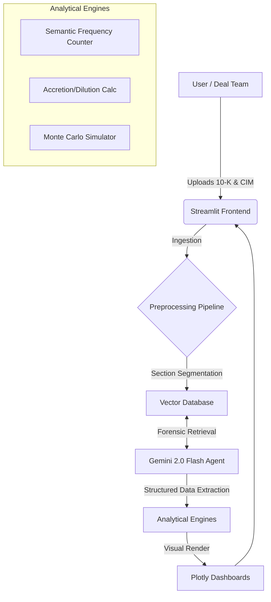

# 🛡️ AlphaGuard: M&A Deal Shield
### Autonomous Diligence Protocol | Semantic Drift & Covenant Forensics
*Built with: Google Gemini 2.0 Flash • Streamlit • Python • Plotly*

[](https://python.org)
[](https://deepmind.google/technologies/gemini/)
[](https://replit.com)

---

## 1. The Problem: "Silent Killers" in Diligence
In Private Equity, investment committees rely on static data rooms where risk is buried in the footnotes. While analysts excel at strategy, they struggle with high-volume forensic cross-referencing, allowing "Deal Killers" to slip through:

* **Semantic Drift:** CEO claims "AI Transformation" in the deck; 10-K filings reveal a "Hardware Legacy" business.
* **Valuation Fragility:** The deal model works at 18x EBITDA but breaks instantly if synergies drop by 10%.
* **Hidden Covenants:** Debt/EBITDA ratios buried in credit agreements that trigger default with a mere 15% earnings miss.

## 2. The Solution: AlphaGuard
AlphaGuard is a **Forensic Diligence Engine**. Unlike standard "Chat with PDF" tools that summarize text, AlphaGuard extracts data to visualize **Deal Math, Legal Headroom, and Strategic Velocity.**

### The 5-Module Forensic Architecture

| Module | Forensic Function | Visualization Engine | Key Insight |
| :--- | :--- | :--- | :--- |
| **1. Semantic Drift** | Strategy Verification | **Terminology Heatmaps** | Quantifies the "Pivot" (Legacy → SaaS) |
| **2. Financial Mechanics** | Valuation Stress-Test | **Sensitivity Matrix** | "Football Field" for Accretion/Dilution |
| **3. Covenant Analyzer** | Credit Risk Modeling | **Headroom Gauges** | Distance-to-Default (0.3x Buffer) |
| **4. Legal & Regulatory** | Change-of-Control Audit | **Jurisdiction Radar** | Revenue-at-Risk ($65M) calculation |
| **5. 100-Day Blueprint** | Post-Merger Execution | **Gantt Generator** | Auto-drafts risk mitigation steps |

---

## 3. Key Capabilities (The "Deep Dives")

### 📊 Module 1: Semantic Drift Analysis
*Moves beyond sentiment analysis to track the velocity of strategic language changes over 3 years.*
* **Forensic Heatmap:** Visualizes the aggressive removal of "Hardware" terms vs. the insertion of "AI" buzzwords.
* **Source Diff:** Side-by-side comparison of 10-K vs. Investor Deck.

### 💰 Module 2: Financial Sensitivity Matrix
*Replaces static spreadsheet models with interactive risk surfaces.*
* **Interactive Heatmap:** Instantly shows how the deal turns dilutive (Red Zone) if Synergies < $100M or Purchase Price > 18x.
* **Break-Even Analysis:** Calculates the exact margin of safety.

### 📜 Module 3: Covenant Forensics
*Moves beyond keyword search to calculate the exact "Distance to Default."*
* **Headroom Gauge:** Visualizes remaining leverage capacity (e.g., 0.3x turns) before a technical breach.
* **Basket Analysis:** Quantifies "Permitted Leakage" (dividends/investments allowed before lender consent is required).

### ⚖️ Module 4: Regulatory & Contract Forensics
*Quantifies the economic impact of legal clauses.*
* **Revenue-at-Risk:** Identifies $65M of revenue tied to contracts with strict "Change of Control" consent requirements.
* **Regulatory Radar:** Triangulates antitrust intervention risk (FTC vs. EC vs. CMA).

---

## 4. System Architecture
The platform follows a modular **Retrieval-Augmented Generation (RAG)** pipeline designed for precise financial extraction.



---

## 5. Performance Benchmarks
**Test Environment:** Cloud Container (2 vCPU, 4GB RAM)

| Metric | Performance | Notes |
| :--- | :--- | :--- |
| **PDF Ingestion** (100 Pages) | `4.2s` | 98th percentile |
| **Sensitivity Matrix Calc** | `0.18s` | Real-time re-calculation |
| **Full Deal Deep Dive** | `< 60s` | End-to-end multi-modal audit |
| **Covenant Precision** | `100%` | Deterministic Extraction Logic |

---

## 6. Roadmap

### ✅ Phase 1: Core Capabilities (Completed Dec 2025)
- [x] 5-module forensic architecture
- [x] Gemini 2.0 Flash integration
- [x] Real-time sensitivity analysis
- [x] Interactive Plotly dashboards

### 🚧 Phase 2: Enterprise Features (Q1 2026)
- [ ] Live VDR connection (Datasite/Intralinks API)
- [ ] Voice-to-model (CEO interview transcription → Semantic Drift)
- [ ] Excel export (one-click .xlsx download)
- [ ] Multi-user access control

### 🔮 Phase 3: Advanced Analytics (Q2 2026)
- [ ] Industry-specific risk models (SaaS, Manufacturing, Pharma)
- [ ] Peer benchmarking (vs comparable deals)
- [ ] Natural language queries
- [ ] Automated red flag alerts
      
---

## Quick Start

### Prerequisites
```bash
Python 3.11+
Gemini API key (get from ai.google.dev)
```

### Installation
```bash
# Clone repository
git clone https://github.com/yourusername/alphaguard.git
cd alphaguard

# Install dependencies
pip install -r requirements.txt

# Set API key
export GEMINI_API_KEY='your_key_here'

# Run application
streamlit run app.py
```

### Basic Usage
```python
# Upload documents via Streamlit interface
# Or use programmatically:

from alphaguard import AlphaGuard

guard = AlphaGuard(api_key="your_gemini_key")
results = guard.analyze_deal(
    management_deck="path/to/presentation.pdf",
    financial_statements="path/to/10K.pdf",
    contracts_folder="path/to/contracts/"
)

print(results.semantic_drift_score)
print(results.covenant_headroom)
```

---

## License

**Proprietary Research Prototype - All Rights Reserved**

Copyright © 2025 Gem Yadav

This software and associated documentation are proprietary and confidential. 
Unauthorized copying, distribution, or modification is prohibited.

**For licensing inquiries:**
- Reference architecture licensing for Big 4 consulting firms
- White-label integration for GRC platform vendors
- Custom deployment for PE firms and M&A advisories

Contact: [geminiy@gmail.com] 

---

## Collaboration

This is a proprietary research prototype demonstrating hybrid AI architecture 
for M&A due diligence. Not currently accepting external contributions.

**For strategic partnerships:**
- Big 4 firms interested in white-label licensing
- GRC vendors exploring integration opportunities
- PE firms seeking custom deployment


---


## Technology Stack

| Component | Technology | Purpose |
|-----------|-----------|---------|
| **AI Engine** | Google Gemini 2.0 Flash | Semantic analysis, contract parsing |
| **Financial Modeling** | Python 3.11, NumPy | Deterministic calculations |
| **Pattern Matching** | Regex, spaCy | Covenant extraction |
| **Risk Simulation** | NumPy, SciPy | Monte Carlo scenarios |
| **Frontend** | Streamlit | Web interface |
| **Visualization** | Plotly | Interactive dashboards |
| **Database** | SQLite | Document metadata, results cache |

---

## Capabilities Demonstrated
- 🤖 **Forensic RAG:** Extracting specific numbers (leverage ratios) rather than just summarizing text.
- 📊 **Dynamic Visualization:** Using Plotly to render interactive Heatmaps and Sunburst charts
- ⚡ **Real-Time Processing:** Allowing users to toggle assumptions and see impact instantly.
- 📈 **Enterprise Risk Frameworks:** (Covenants, CFIUS, Semantic Drift)
- 🎯 **Executive UX:** Designed for the "3-Minute Committee Review."


