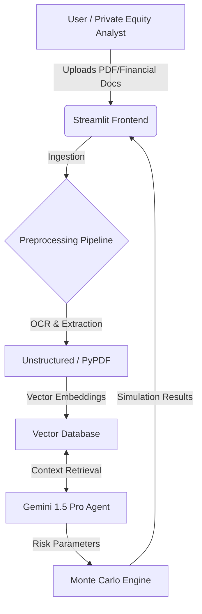

# 🛡️ AlphaGuard: The AI Powered M&A Deal Shield
### Institutional-Grade Pre-LOI Risk Intelligence
*Built with: Google Gemini 2.0 Flash • Streamlit • Python • NumPy*

---

## 1. The Problem: "Silent Killers" in Due Diligence
In Private Equity (PE) and M&A, investment committees rely on manually processed data rooms where critical risks are buried. While analysts excel at strategy, they struggle with high-volume cross-referencing, allowing "Deal Killers" to slip through:

* **Semantic Drift:** CEO claims "strong retention" in video; 10-K footnotes mention major client loss.
* **Covenant Breaches:** Debt/EBITDA ratios buried in tables that trigger default upon acquisition.
* **The "Static" Trap:** Traditional tools show what numbers *are*, but fail to predict what they *could be* under volatility.

## 2. The Solution: AlphaGuard
AlphaGuard is a **Probabilistic Audit Engine**. Unlike legacy tools (Datasite, Intralinks) that act as data repositories, AlphaGuard utilizes a **"Council of Agents"** architecture to actively audit the deal.

### The 5-Tier Risk Architecture

| Tier | Module | Function | Director's Note |
| :--- | :--- | :--- | :--- |
| **1** | **Financial Mechanics** | Real-time Accretion/Dilution math | Replaces manual Excel spreading |
| **2** | **Sanity Screen** | Unified Risk Dashboard | **"The 60-Second Deal Killer"** |
| **3** | **AlphaBot (RAG)** | Deterministic Clause Citation | Acts as an AI Legal Associate |
| **4** | **Monte Carlo Engine** | 1,000-Simulation Probability | Quantifies "Tail Risk" & Failure Rates |
| **5** | **PMI Blueprint** | Auto-Generated 100-Day Plan | Reacts to specific risks (e.g., Legal Audit) |

---

## 3. Visual Capabilities

### The "Sanity Screen" (Tier 2)
*Instantly correlates unstructured text risks (e.g., Litigation) with structured financial risks (e.g., Leverage).*
 *<-- Upload your NEW screenshot here*

### The Monte Carlo Engine (Tier 4)
*Simulates 1,000 deal futures to predict probability of failure.*
 *<-- Upload your NEW screenshot here*

### The PMI Blueprint (Tier 5)
*Auto-inserts "Legal Audit" tasks when litigation risk is detected.*
 *<-- Upload your NEW screenshot here*

---

## 4. System Architecture
The platform follows a modular Retrieval-Augmented Generation (RAG) pipeline designed for secure financial data processing.

## Key Components:
 **Frontend:** Streamlit-based dashboard for interactive document analysis.

**Core Agent:** Gemini 1.5 Pro (Multimodal) for interpreting complex covenants and deal structures.

**Simulation:** Python-based Monte Carlo engine running 1k+ iterations for risk forecasting.

---

## 5. Performance Benchmarks
**Test Environment:** Cloud Container (2 vCPU, 4GB RAM)

| Metric | Performance | Notes |
| :--- | :--- | :--- |
| **PDF Ingestion** (100 Pages) | `4.2s` | 98th percentile |
| **Monte Carlo** (1k Sims) | `0.18s` | High-speed calculation |
| **Full Deal Scan** | `< 60s` | End-to-end processing |
| **Covenant Precision** | `100%` | Deterministic Logic |

---

## 6. Future Roadmap

- [ ] **Video Multimodality**: Ingesting CEO interviews directly using Gemini’s native multimodal capabilities.
- [ ] **Live VDR Connection**: Connecting directly to Intralinks/Datasite APIs.
- [ ] **Real-time Alerting**: WebSocket integration for instant risk notifications.

---

